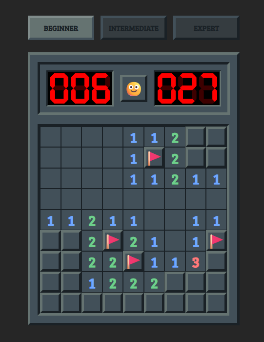
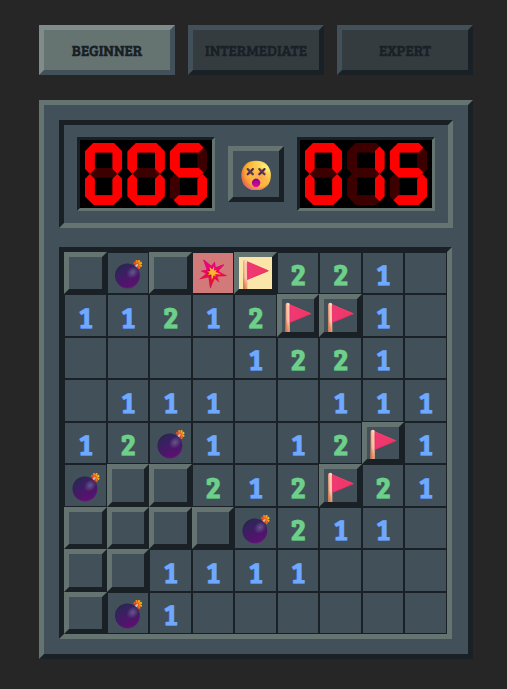
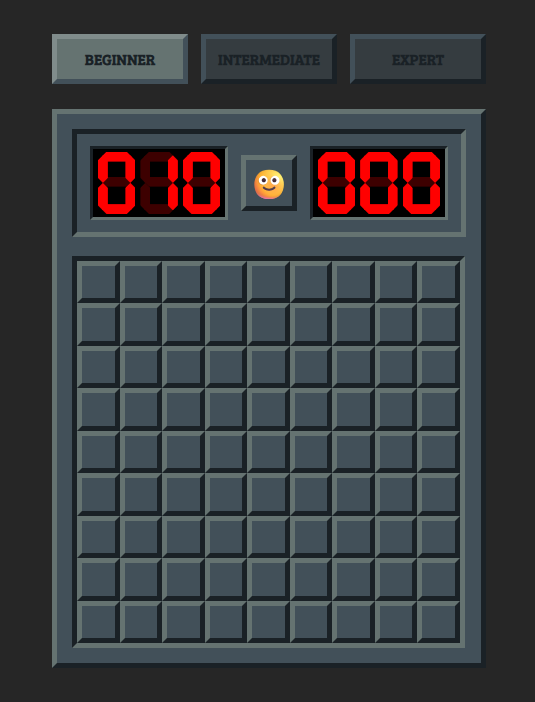
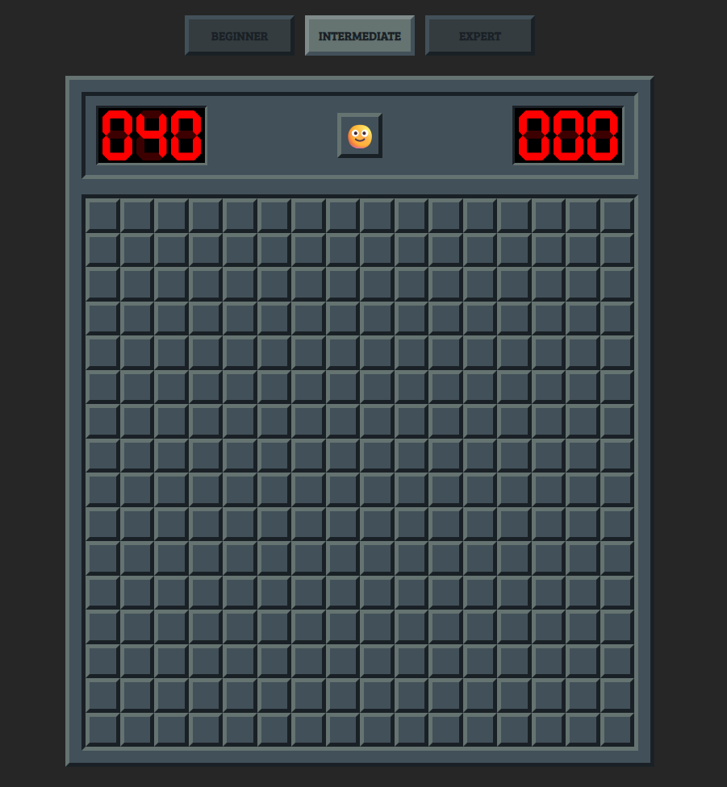
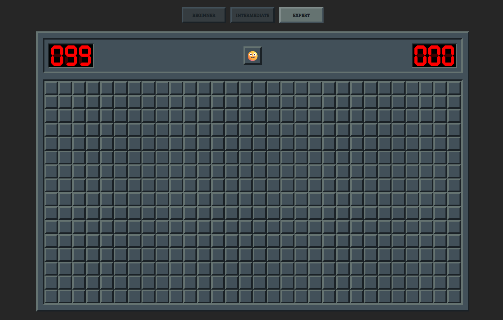
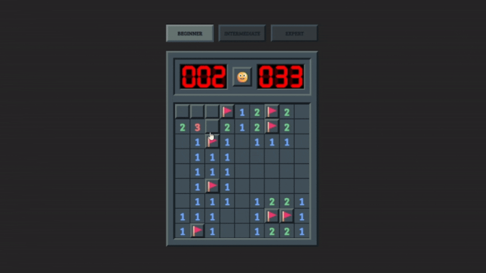

# 💣 Minesweeper

<p align="center">
  
</p>

<p align="center">
  A modern, interactive clone of the classic Minesweeper built with <b>Vanilla TypeScript</b>.
</p>

<p align="center">
  
  
  
  
  
</p>

---

## 🚀 Live Demo

👉 *https://minesweeper-vininnn.netlify.app/*

---

## ✨ Features

* **3 Difficulty Levels:**
    * **Beginner:** 9x9 with 10 bombs
    * **Intermediate:** 16x16 with 40 bombs
    * **Expert:** 16x30 with 99 bombs

* **7-Segment Display:**  
  Custom logic to render digital-style numbers (timer and flag counter) using pure HTML and CSS.

* **Full Classic Mechanics:**  
  Includes a *Flood Fill* algorithm to reveal adjacent empty cells (recursion) and a flagging system.

* **Victory Animation:**  
  Integration with `canvas-confetti` to celebrate when the player wins.

* **Themed Design:**  
  Well-structured CSS variables to maintain a consistent dark and elegant theme.

---

## 🛠️ Tech Stack

| Technology      | Purpose                     |
|-----------------|-----------------------------|
| TypeScript      | Logic, typing, architecture |
| HTML5           | Structure                   |
| CSS3            | Styling (Grid + Flexbox)    |
| Canvas Confetti | Win animation               |

---

## 📦 Installation & Setup

Since the project is written in TypeScript, files need to be transpiled to JavaScript or run through a bundler (such as Vite).

### Prerequisites
- [Node.js](https://nodejs.org/)

### Steps

1. Clone the repository:
   ```bash
   git clone https://github.com/your-username/minesweeper.git
   
2. Enter the project folder:
   ```bash
    cd minesweeper

3. Install dependencies:
   ```bash
    npm install

4. Run development server:
   ```bash
    npm run dev

5. Open your browser at the URL provided in the terminal
(usually http://localhost:5173)

---

##   📷 Screenshots
### Gameplay 🎮

<p align="center"> 
    
     
</p>

|                                               Beginner                                               |                                                 Intermediate                                                 |                                              Expert                                              |
|:----------------------------------------------------------------------------------------------------:|:------------------------------------------------------------------------------------------------------------:|:------------------------------------------------------------------------------------------------:|
| <p align="center">  </p> | <p align="center">  </p> | <p align="center">  </p> |

### Victory 🎉

<p align="center">  </p>

---

## 📄 License

<p align="center">
  
</p>